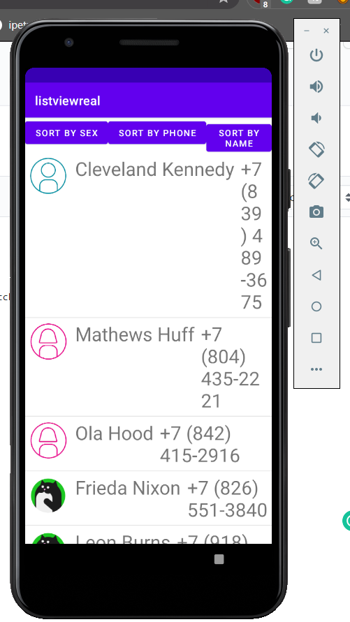
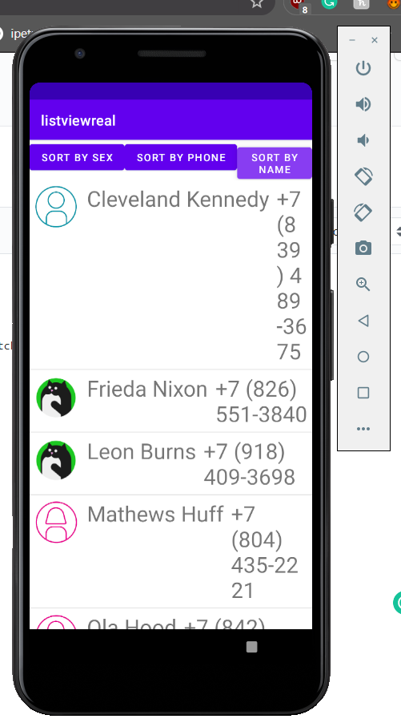

# ListView практикум 1 (разработка собственного адаптера)

В данном практикуме мы повторяем известное об адаптерах, как посредниках между источниками данных и их отображением.

Используйте проект-заготовку https://github.com/ipetrushin/CustomAdapterDemo и инструкцию https://www.youtube.com/watch?v=000bfXtthbM

Задание по доработке приложения отражены в TODO-комментариях:

```
// TODO: реализовать загрузку данных из JSON-файла
// который загрузить в папку assets

// TODO: реализовать сортировку по каждому из полей
// класса: sex, name, phoneNumber
```

В качестве ответа приложите ссылку на репозиторий Git и примеры работы приложения.

[**Пример работы приложения**](video1.mp4)



